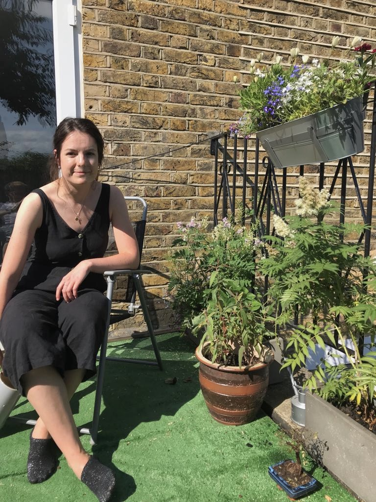

    

Hello, Website! Welcome to the world.
I am a Research Data Scientist working at Barts Health NHS Trust, where I use data from electronic health records to predict risk of patients developing vascular complications of diabetes. I have a PhD in Neuroscience from UCL, where I carried out experimental and computational work looking at changes in brain excitability after seizures and testing the mechanism of action of new anti-seizure compounds (extracted from coconuts!).
I have 2 years experience in applied data science within the Civil Service.

